# Data Model: Month-End Market Analyst

**Feature**: 001-month-end-analyst
**Created**: 2025-10-30
**Status**: Draft

## Table of Contents

1. [Entity Definitions](#entity-definitions)
2. [Entity Relationship Diagram](#entity-relationship-diagram)
3. [Database Schema Notes](#database-schema-notes)
4. [Migration Strategy](#migration-strategy)

---

## Entity Definitions

### 1. User

**Purpose**: Represents an investor account with authentication credentials, preferences, and configuration settings.

#### Fields

| Field Name | Data Type | Constraints | Default | Description |
|------------|-----------|-------------|---------|-------------|
| id | UUID | PRIMARY KEY, NOT NULL | gen_random_uuid() | Unique user identifier |
| email | String (255) | NOT NULL, UNIQUE | - | User email address for authentication |
| password_hash | String (255) | NOT NULL | - | Bcrypt hashed password |
| first_name | String (100) | NULL | - | User's first name |
| last_name | String (100) | NULL | - | User's last name |
| base_currency | String (3) | NOT NULL | 'USD' | ISO 4217 currency code |
| selected_universe_id | UUID | NULL, FK(universe.id) | - | Currently selected investment universe |
| role | Enum | NOT NULL | 'OWNER' | User role: OWNER, VIEWER, SERVICE |
| email_verified | Boolean | NOT NULL | false | Email verification status |
| disclaimer_accepted_at | LocalDateTime | NULL | - | Timestamp of disclaimer acceptance |
| created_at | LocalDateTime | NOT NULL | CURRENT_TIMESTAMP | Account creation timestamp |
| updated_at | LocalDateTime | NOT NULL | CURRENT_TIMESTAMP | Last modification timestamp |
| last_login_at | LocalDateTime | NULL | - | Last successful login timestamp |
| timezone | String (50) | NOT NULL | 'America/New_York' | User's timezone for scheduling |
| notification_preferences | JSONB | NOT NULL | {} | Notification settings per category |

#### Relationships

- **One-to-One** with Portfolio (user owns one portfolio)
- **Many-to-One** with Universe (user selects one universe, universe can be selected by many users)
- **One-to-Many** with ConstraintSet (user can create multiple constraint configurations)
- **One-to-Many** with RecommendationRun (user can have multiple recommendation runs)
- **One-to-Many** with Backtest (user can run multiple backtests)
- **One-to-Many** with Notification (user receives many notifications)

#### Indexes

- `PRIMARY KEY (id)`
- `UNIQUE INDEX idx_user_email ON user(email)`
- `INDEX idx_user_universe ON user(selected_universe_id)`
- `INDEX idx_user_created ON user(created_at DESC)`
- `INDEX idx_user_role ON user(role)` - for admin queries

#### Validation Rules

- Email must match RFC 5322 pattern
- Password must be at least 12 characters with complexity requirements (enforced at application layer)
- Base currency must be valid ISO 4217 code
- Role must be one of: OWNER, VIEWER, SERVICE
- Timezone must be valid IANA timezone identifier
- Notification preferences JSON must conform to defined schema

#### State Transitions

N/A - User is not a stateful entity beyond email_verified flag.

---

### 2. Portfolio

**Purpose**: Aggregates all holdings for a user with calculated metrics and performance tracking.

#### Fields

| Field Name | Data Type | Constraints | Default | Description |
|------------|-----------|-------------|---------|-------------|
| id | UUID | PRIMARY KEY, NOT NULL | gen_random_uuid() | Unique portfolio identifier |
| user_id | UUID | NOT NULL, UNIQUE, FK(user.id) | - | Owner of the portfolio |
| cash_balance | BigDecimal(19,4) | NOT NULL, CHECK >= 0 | 0.0000 | Available cash in base currency |
| total_market_value | BigDecimal(19,4) | NOT NULL, CHECK >= 0 | 0.0000 | Sum of all holdings market values |
| total_cost_basis | BigDecimal(19,4) | NOT NULL, CHECK >= 0 | 0.0000 | Sum of all holdings cost basis |
| unrealized_pnl | BigDecimal(19,4) | NOT NULL | 0.0000 | Total unrealized profit/loss |
| unrealized_pnl_pct | BigDecimal(10,6) | NOT NULL | 0.000000 | Unrealized P&L as percentage |
| benchmark_return_pct | BigDecimal(10,6) | NOT NULL | 0.000000 | Benchmark return for comparison period |
| relative_return_pct | BigDecimal(10,6) | NOT NULL | 0.000000 | Portfolio return vs benchmark |
| universe_coverage_pct | BigDecimal(5,2) | NOT NULL, CHECK >= 0 AND <= 100 | 0.00 | Percentage of holdings in selected universe |
| last_calculated_at | LocalDateTime | NOT NULL | CURRENT_TIMESTAMP | Timestamp of last portfolio calculation |
| created_at | LocalDateTime | NOT NULL | CURRENT_TIMESTAMP | Portfolio creation timestamp |
| updated_at | LocalDateTime | NOT NULL | CURRENT_TIMESTAMP | Last modification timestamp |

#### Relationships

- **One-to-One** with User (portfolio belongs to one user)
- **One-to-Many** with Holding (portfolio contains many holdings)

#### Indexes

- `PRIMARY KEY (id)`
- `UNIQUE INDEX idx_portfolio_user ON portfolio(user_id)`
- `INDEX idx_portfolio_updated ON portfolio(updated_at DESC)`
- `INDEX idx_portfolio_calculated ON portfolio(last_calculated_at DESC)`

#### Validation Rules

- Cash balance cannot be negative
- Total market value must equal sum of holdings' market values
- Total cost basis must equal sum of holdings' cost basis
- Unrealized P&L must equal total_market_value - total_cost_basis
- Universe coverage percentage must be between 0 and 100
- Last calculated timestamp must not be more than 24 hours old for active portfolios

#### State Transitions

N/A - Portfolio values are recalculated on-demand, not state-based.

---

### 3. Holding

**Purpose**: Represents a single stock position within a portfolio with cost basis and current valuation.

#### Fields

| Field Name | Data Type | Constraints | Default | Description |
|------------|-----------|-------------|---------|-------------|
| id | UUID | PRIMARY KEY, NOT NULL | gen_random_uuid() | Unique holding identifier |
| portfolio_id | UUID | NOT NULL, FK(portfolio.id) | - | Parent portfolio |
| symbol | String (20) | NOT NULL | - | Stock ticker symbol |
| quantity | BigDecimal(19,6) | NOT NULL, CHECK > 0 | - | Number of shares held |
| cost_basis | BigDecimal(19,4) | NOT NULL, CHECK > 0 | - | Total cost in base currency |
| cost_basis_per_share | BigDecimal(19,4) | NOT NULL, CHECK > 0 | - | Average cost per share |
| acquisition_date | LocalDate | NOT NULL | - | Date of acquisition |
| currency | String (3) | NOT NULL | - | ISO 4217 currency code |
| current_price | BigDecimal(19,4) | NOT NULL, CHECK >= 0 | 0.0000 | Latest market price in holding currency |
| current_market_value | BigDecimal(19,4) | NOT NULL, CHECK >= 0 | 0.0000 | quantity * current_price in base currency |
| unrealized_pnl | BigDecimal(19,4) | NOT NULL | 0.0000 | current_market_value - cost_basis |
| unrealized_pnl_pct | BigDecimal(10,6) | NOT NULL | 0.000000 | (unrealized_pnl / cost_basis) * 100 |
| weight_pct | BigDecimal(5,2) | NOT NULL, CHECK >= 0 AND <= 100 | 0.00 | Position size as % of portfolio |
| in_universe | Boolean | NOT NULL | false | Whether symbol is in selected universe |
| sector | String (50) | NULL | - | GICS sector classification |
| market_cap_tier | Enum | NULL | - | LARGE_CAP, MID_CAP, SMALL_CAP |
| fx_rate_to_base | BigDecimal(19,8) | NOT NULL, CHECK > 0 | 1.00000000 | FX rate used for currency conversion |
| price_updated_at | LocalDateTime | NULL | - | Timestamp of last price update |
| created_at | LocalDateTime | NOT NULL | CURRENT_TIMESTAMP | Holding creation timestamp |
| updated_at | LocalDateTime | NOT NULL | CURRENT_TIMESTAMP | Last modification timestamp |

#### Relationships

- **Many-to-One** with Portfolio (holding belongs to one portfolio)
- **One-to-Many** with FactorScore (holding has multiple factor scores)

#### Indexes

- `PRIMARY KEY (id)`
- `INDEX idx_holding_portfolio ON holding(portfolio_id)`
- `UNIQUE INDEX idx_holding_portfolio_symbol ON holding(portfolio_id, symbol)`
- `INDEX idx_holding_symbol ON holding(symbol)` - for lookup queries
- `INDEX idx_holding_universe ON holding(in_universe)` - for coverage calculations
- `INDEX idx_holding_updated ON holding(updated_at DESC)`
- `INDEX idx_holding_sector ON holding(sector)` - for sector analysis

#### Validation Rules

- Quantity must be positive (no short positions)
- Cost basis must be positive
- Symbol must be valid ticker format (uppercase, alphanumeric plus dash/dot)
- Currency must be valid ISO 4217 code
- Current price cannot be negative
- Weight percentage must be between 0 and 100
- Market cap tier must be one of: LARGE_CAP, MID_CAP, SMALL_CAP
- FX rate must be positive
- Current market value must equal quantity * current_price * fx_rate_to_base
- Unrealized P&L must equal current_market_value - cost_basis

#### State Transitions

N/A - Holding values are recalculated when prices update, not state-based.

---

### 4. Universe

**Purpose**: Defines a predefined or custom stock universe with constituent symbols and classifications.

#### Fields

| Field Name | Data Type | Constraints | Default | Description |
|------------|-----------|-------------|---------|-------------|
| id | UUID | PRIMARY KEY, NOT NULL | gen_random_uuid() | Unique universe identifier |
| name | String (100) | NOT NULL, UNIQUE | - | Universe name (e.g., "S&P 500") |
| description | String (500) | NULL | - | Human-readable description |
| type | Enum | NOT NULL | - | PRESET, CUSTOM, REGIONAL |
| benchmark_symbol | String (20) | NOT NULL | - | Index symbol for benchmark comparison |
| constituent_count | Integer | NOT NULL, CHECK > 0 | - | Number of stocks in universe |
| min_market_cap | BigDecimal(19,4) | NULL | - | Minimum market cap filter (USD millions) |
| max_market_cap | BigDecimal(19,4) | NULL | - | Maximum market cap filter (USD millions) |
| liquidity_tier_threshold | JSONB | NOT NULL | {} | ADV thresholds per liquidity tier |
| is_active | Boolean | NOT NULL | true | Whether universe is available for selection |
| version | Integer | NOT NULL | 1 | Version number for constituent changes |
| effective_date | LocalDate | NOT NULL | - | Date universe composition became effective |
| created_at | LocalDateTime | NOT NULL | CURRENT_TIMESTAMP | Universe creation timestamp |
| updated_at | LocalDateTime | NOT NULL | CURRENT_TIMESTAMP | Last modification timestamp |

#### Relationships

- **One-to-Many** with User (universe can be selected by many users)
- **One-to-Many** with UniverseConstituent (universe contains many stocks)
- **One-to-Many** with RecommendationRun (universe is used in many runs)

#### Indexes

- `PRIMARY KEY (id)`
- `UNIQUE INDEX idx_universe_name ON universe(name)`
- `INDEX idx_universe_type ON universe(type)`
- `INDEX idx_universe_active ON universe(is_active)`
- `INDEX idx_universe_effective ON universe(effective_date DESC)`

#### Validation Rules

- Name must be unique and non-empty
- Type must be one of: PRESET, CUSTOM, REGIONAL
- Benchmark symbol must be valid ticker format
- Constituent count must be positive
- If max_market_cap is set, it must be greater than min_market_cap
- Liquidity tier threshold JSON must define at least 3 tiers
- Version must be positive integer, incremented on constituent changes

#### State Transitions

N/A - Universe is versioned; constituent changes create new version.

---

### 5. UniverseConstituent

**Purpose**: Junction table linking stocks to universes with classification metadata.

#### Fields

| Field Name | Data Type | Constraints | Default | Description |
|------------|-----------|-------------|---------|-------------|
| id | UUID | PRIMARY KEY, NOT NULL | gen_random_uuid() | Unique constituent identifier |
| universe_id | UUID | NOT NULL, FK(universe.id) | - | Parent universe |
| symbol | String (20) | NOT NULL | - | Stock ticker symbol |
| company_name | String (255) | NOT NULL | - | Company legal name |
| sector | String (50) | NOT NULL | - | GICS sector classification |
| industry | String (100) | NULL | - | GICS industry classification |
| market_cap_tier | Enum | NOT NULL | - | LARGE_CAP, MID_CAP, SMALL_CAP |
| liquidity_tier | Integer | NOT NULL, CHECK >= 1 AND <= 5 | - | Liquidity classification (1=most liquid) |
| avg_daily_volume | BigDecimal(19,2) | NOT NULL, CHECK > 0 | - | 30-day average daily volume (shares) |
| avg_daily_value | BigDecimal(19,4) | NOT NULL, CHECK > 0 | - | 30-day average daily value (USD) |
| is_active | Boolean | NOT NULL | true | Whether stock is actively included |
| added_date | LocalDate | NOT NULL | - | Date stock was added to universe |
| removed_date | LocalDate | NULL | - | Date stock was removed (if applicable) |
| created_at | LocalDateTime | NOT NULL | CURRENT_TIMESTAMP | Record creation timestamp |
| updated_at | LocalDateTime | NOT NULL | CURRENT_TIMESTAMP | Last modification timestamp |

#### Relationships

- **Many-to-One** with Universe (constituent belongs to one universe)

#### Indexes

- `PRIMARY KEY (id)`
- `INDEX idx_constituent_universe ON universe_constituent(universe_id)`
- `UNIQUE INDEX idx_constituent_universe_symbol ON universe_constituent(universe_id, symbol)`
- `INDEX idx_constituent_symbol ON universe_constituent(symbol)` - for cross-universe queries
- `INDEX idx_constituent_sector ON universe_constituent(sector)` - for sector analysis
- `INDEX idx_constituent_active ON universe_constituent(is_active)`
- `INDEX idx_constituent_liquidity ON universe_constituent(liquidity_tier)` - for constraint evaluation

#### Validation Rules

- Symbol must be valid ticker format
- Sector must be one of 11 GICS sectors
- Market cap tier must be one of: LARGE_CAP, MID_CAP, SMALL_CAP
- Liquidity tier must be between 1 and 5 (1=most liquid)
- Average daily volume must be positive
- Average daily value must be positive
- If removed_date is set, is_active must be false
- Added date must be before removed date (if set)

#### State Transitions

N/A - Constituent is simply marked active/inactive via is_active flag.

---

### 6. ConstraintSet

**Purpose**: Stores user-configurable risk parameters and portfolio construction rules.

#### Fields

| Field Name | Data Type | Constraints | Default | Description |
|------------|-----------|-------------|---------|-------------|
| id | UUID | PRIMARY KEY, NOT NULL | gen_random_uuid() | Unique constraint set identifier |
| user_id | UUID | NOT NULL, FK(user.id) | - | Owner of constraint set |
| name | String (100) | NOT NULL | - | Constraint set name |
| is_active | Boolean | NOT NULL | false | Whether this is the active constraint set |
| max_name_weight_large_cap_pct | BigDecimal(5,2) | NOT NULL, CHECK > 0 AND <= 100 | 5.00 | Max position size for large caps |
| max_name_weight_mid_cap_pct | BigDecimal(5,2) | NOT NULL, CHECK > 0 AND <= 100 | 2.00 | Max position size for mid caps |
| max_name_weight_small_cap_pct | BigDecimal(5,2) | NOT NULL, CHECK > 0 AND <= 100 | 1.00 | Max position size for small caps |
| max_sector_exposure_pct | BigDecimal(5,2) | NOT NULL, CHECK > 0 AND <= 100 | 20.00 | Max allocation to any single sector |
| turnover_cap_pct | BigDecimal(5,2) | NOT NULL, CHECK > 0 AND <= 100 | 25.00 | Max portfolio turnover per period |
| weight_deadband_bps | Integer | NOT NULL, CHECK > 0 AND <= 1000 | 30 | Min weight change to trigger trade (basis points) |
| participation_cap_tier1_pct | BigDecimal(5,2) | NOT NULL, CHECK > 0 AND <= 100 | 10.00 | Max % of ADV for tier 1 liquidity |
| participation_cap_tier2_pct | BigDecimal(5,2) | NOT NULL, CHECK > 0 AND <= 100 | 7.50 | Max % of ADV for tier 2 liquidity |
| participation_cap_tier3_pct | BigDecimal(5,2) | NOT NULL, CHECK > 0 AND <= 100 | 5.00 | Max % of ADV for tier 3 liquidity |
| participation_cap_tier4_pct | BigDecimal(5,2) | NOT NULL, CHECK > 0 AND <= 100 | 3.00 | Max % of ADV for tier 4 liquidity |
| participation_cap_tier5_pct | BigDecimal(5,2) | NOT NULL, CHECK > 0 AND <= 100 | 1.00 | Max % of ADV for tier 5 liquidity |
| spread_threshold_bps | Integer | NOT NULL, CHECK > 0 | 50 | Max bid-ask spread (basis points) |
| earnings_blackout_hours | Integer | NOT NULL, CHECK >= 0 | 48 | Hours before earnings to exclude stock |
| liquidity_floor_adv_usd | BigDecimal(19,4) | NOT NULL, CHECK >= 0 | 1000000.00 | Min average daily value in USD |
| cost_margin_required_bps | Integer | NOT NULL, CHECK > 0 | 20 | Min expected alpha over cost (basis points) |
| version | Integer | NOT NULL | 1 | Version number for audit trail |
| created_at | LocalDateTime | NOT NULL | CURRENT_TIMESTAMP | Constraint set creation timestamp |
| updated_at | LocalDateTime | NOT NULL | CURRENT_TIMESTAMP | Last modification timestamp |

#### Relationships

- **Many-to-One** with User (constraint set belongs to one user)
- **One-to-Many** with RecommendationRun (constraint set is used in many runs)
- **One-to-Many** with Backtest (constraint set is used in many backtests)

#### Indexes

- `PRIMARY KEY (id)`
- `INDEX idx_constraint_user ON constraint_set(user_id)`
- `INDEX idx_constraint_active ON constraint_set(user_id, is_active)` - for retrieving active set
- `INDEX idx_constraint_created ON constraint_set(created_at DESC)`

#### Validation Rules

- Name must be non-empty
- Only one constraint set per user can have is_active = true
- All percentage constraints must be between 0 and 100
- Weight deadband must be between 1 and 1000 basis points
- Participation caps must be in descending order: tier1 >= tier2 >= tier3 >= tier4 >= tier5
- Spread threshold must be positive
- Earnings blackout hours typically 24-72 hours
- Liquidity floor must be non-negative
- Cost margin required must be positive
- Version must be positive integer, incremented on updates

#### State Transitions

N/A - Only one constraint set is "active" at a time; toggling is_active is the only state change.

---

### 7. RecommendationRun

**Purpose**: Represents a single execution of the recommendation engine with state tracking and audit trail.

#### Fields

| Field Name | Data Type | Constraints | Default | Description |
|------------|-----------|-------------|---------|-------------|
| id | UUID | PRIMARY KEY, NOT NULL | gen_random_uuid() | Unique run identifier |
| user_id | UUID | NOT NULL, FK(user.id) | - | Owner of the run |
| universe_id | UUID | NOT NULL, FK(universe.id) | - | Universe used for analysis |
| constraint_set_id | UUID | NOT NULL, FK(constraint_set.id) | - | Constraints snapshot used |
| run_type | Enum | NOT NULL | - | SCHEDULED, MANUAL, OFF_CYCLE |
| status | Enum | NOT NULL | 'SCHEDULED' | SCHEDULED, PRE_COMPUTE, STAGED, FINALIZED, FAILED |
| scheduled_date | LocalDate | NULL | - | Target month-end date (for scheduled runs) |
| started_at | LocalDateTime | NULL | - | Run execution start timestamp |
| completed_at | LocalDateTime | NULL | - | Run execution completion timestamp |
| execution_duration_ms | Long | NULL | - | Total execution time in milliseconds |
| recommendation_count | Integer | NOT NULL | 0 | Number of recommendations generated |
| exclusion_count | Integer | NOT NULL | 0 | Number of stocks excluded |
| expected_turnover_pct | BigDecimal(5,2) | NULL, CHECK >= 0 AND <= 100 | - | Estimated portfolio turnover |
| estimated_cost_bps | BigDecimal(7,2) | NULL, CHECK >= 0 | - | Estimated transaction cost (basis points) |
| expected_alpha_bps | BigDecimal(7,2) | NULL | - | Expected alpha generation (basis points) |
| decision | Enum | NOT NULL | 'PENDING' | PENDING, RECOMMENDATIONS, NO_TRADE, ERROR |
| decision_reason | String (500) | NULL | - | Explanation for decision |
| previous_run_id | UUID | NULL, FK(recommendation_run.id) | - | Reference to previous run for comparison |
| error_message | String (1000) | NULL | - | Error details if status is FAILED |
| data_freshness_check_passed | Boolean | NOT NULL | false | Whether all data sources were current |
| constraint_feasibility_check_passed | Boolean | NOT NULL | false | Whether constraints allow feasible solution |
| created_at | LocalDateTime | NOT NULL | CURRENT_TIMESTAMP | Run record creation timestamp |
| updated_at | LocalDateTime | NOT NULL | CURRENT_TIMESTAMP | Last modification timestamp |

#### Relationships

- **Many-to-One** with User (run belongs to one user)
- **Many-to-One** with Universe (run uses one universe)
- **Many-to-One** with ConstraintSet (run uses one constraint set snapshot)
- **Many-to-One** with RecommendationRun (previous run reference for comparison)
- **One-to-Many** with Recommendation (run generates many recommendations)
- **One-to-Many** with Exclusion (run generates many exclusions)
- **One-to-One** with Report (run produces one report)
- **One-to-Many** with Notification (run triggers notifications)

#### Indexes

- `PRIMARY KEY (id)`
- `INDEX idx_run_user ON recommendation_run(user_id)`
- `INDEX idx_run_status ON recommendation_run(status)`
- `INDEX idx_run_type ON recommendation_run(run_type)`
- `INDEX idx_run_scheduled ON recommendation_run(scheduled_date DESC)` - for scheduled run queries
- `INDEX idx_run_completed ON recommendation_run(completed_at DESC)` - for history queries
- `INDEX idx_run_user_completed ON recommendation_run(user_id, completed_at DESC)` - composite for user history
- `INDEX idx_run_previous ON recommendation_run(previous_run_id)` - for comparison queries

#### Validation Rules

- Run type must be one of: SCHEDULED, MANUAL, OFF_CYCLE
- Status must be one of: SCHEDULED, PRE_COMPUTE, STAGED, FINALIZED, FAILED
- Decision must be one of: PENDING, RECOMMENDATIONS, NO_TRADE, ERROR
- If status is FAILED, error_message must be non-null
- If status is FINALIZED, completed_at must be non-null
- Started_at must be before completed_at (if both set)
- Execution duration must match (completed_at - started_at) if both set
- Expected turnover must be between 0 and 100
- If decision is NO_TRADE, decision_reason must explain why
- If status is FINALIZED and decision is RECOMMENDATIONS, recommendation_count must be > 0
- Data freshness check must pass before run can proceed beyond SCHEDULED

#### State Transitions

```
SCHEDULED -> PRE_COMPUTE -> STAGED -> FINALIZED
         |                               |
         |-----------------------------> FAILED
```

- **SCHEDULED**: Run is queued, awaiting execution
- **PRE_COMPUTE**: Factor scores are being calculated (T-3)
- **STAGED**: Recommendations are generated but not finalized (T-1)
- **FINALIZED**: Recommendations are final and ready for user action (T)
- **FAILED**: Run encountered error and cannot complete

Valid transitions:
- SCHEDULED → PRE_COMPUTE (when scheduled job starts)
- PRE_COMPUTE → STAGED (when factor calculations complete)
- STAGED → FINALIZED (when recommendation optimization completes)
- Any state → FAILED (on error)

---

### 8. Recommendation

**Purpose**: Individual buy recommendation with ranking, confidence, and explanatory data.

#### Fields

| Field Name | Data Type | Constraints | Default | Description |
|------------|-----------|-------------|---------|-------------|
| id | UUID | PRIMARY KEY, NOT NULL | gen_random_uuid() | Unique recommendation identifier |
| run_id | UUID | NOT NULL, FK(recommendation_run.id) | - | Parent recommendation run |
| symbol | String (20) | NOT NULL | - | Stock ticker symbol |
| rank | Integer | NOT NULL, CHECK > 0 | - | Ranking within run (1=highest conviction) |
| target_weight_pct | BigDecimal(5,2) | NOT NULL, CHECK >= 0 AND <= 100 | - | Recommended portfolio weight |
| current_weight_pct | BigDecimal(5,2) | NOT NULL, CHECK >= 0 AND <= 100 | 0.00 | Current portfolio weight |
| weight_change_pct | BigDecimal(5,2) | NOT NULL | 0.00 | target_weight - current_weight |
| confidence_score | Integer | NOT NULL, CHECK >= 0 AND <= 100 | - | Conviction level (0-100) |
| expected_cost_bps | BigDecimal(7,2) | NOT NULL, CHECK >= 0 | - | Estimated transaction cost (basis points) |
| expected_alpha_bps | BigDecimal(7,2) | NOT NULL | - | Expected alpha contribution (basis points) |
| edge_over_cost_bps | BigDecimal(7,2) | NOT NULL | - | expected_alpha - expected_cost |
| driver1_name | String (50) | NOT NULL | - | Top factor driver #1 |
| driver1_score | BigDecimal(7,4) | NOT NULL | - | Driver #1 contribution score |
| driver2_name | String (50) | NOT NULL | - | Top factor driver #2 |
| driver2_score | BigDecimal(7,4) | NOT NULL | - | Driver #2 contribution score |
| driver3_name | String (50) | NOT NULL | - | Top factor driver #3 |
| driver3_score | BigDecimal(7,4) | NOT NULL | - | Driver #3 contribution score |
| explanation | String (1000) | NOT NULL | - | Plain-language explanation of recommendation |
| constraint_notes | String (500) | NULL | - | Notes on constraint impacts |
| risk_contribution_pct | BigDecimal(5,2) | NULL, CHECK >= 0 AND <= 100 | - | Contribution to portfolio risk |
| change_indicator | Enum | NOT NULL | 'NEW' | NEW, INCREASED, DECREASED, UNCHANGED, REMOVED |
| sector | String (50) | NOT NULL | - | GICS sector classification |
| market_cap_tier | Enum | NOT NULL | - | LARGE_CAP, MID_CAP, SMALL_CAP |
| liquidity_tier | Integer | NOT NULL, CHECK >= 1 AND <= 5 | - | Liquidity classification |
| current_price | BigDecimal(19,4) | NOT NULL, CHECK > 0 | - | Stock price at recommendation time |
| created_at | LocalDateTime | NOT NULL | CURRENT_TIMESTAMP | Recommendation creation timestamp |

#### Relationships

- **Many-to-One** with RecommendationRun (recommendation belongs to one run)

#### Indexes

- `PRIMARY KEY (id)`
- `INDEX idx_rec_run ON recommendation(run_id)`
- `UNIQUE INDEX idx_rec_run_symbol ON recommendation(run_id, symbol)`
- `INDEX idx_rec_rank ON recommendation(run_id, rank)` - for sorted display
- `INDEX idx_rec_symbol ON recommendation(symbol)` - for cross-run queries
- `INDEX idx_rec_change ON recommendation(change_indicator)` - for filtering by change type
- `INDEX idx_rec_sector ON recommendation(sector)` - for sector analysis

#### Validation Rules

- Symbol must be valid ticker format
- Rank must be positive and unique within run
- All weight percentages must be between 0 and 100
- Weight change must equal target_weight - current_weight
- Confidence score must be between 0 and 100
- Expected cost must be non-negative
- Edge over cost must equal expected_alpha - expected_cost
- Edge over cost should exceed constraint_set.cost_margin_required_bps
- All driver names must be from defined factor list (Value, Momentum, Quality, Revisions)
- Explanation must be non-empty
- Change indicator must be one of: NEW, INCREASED, DECREASED, UNCHANGED, REMOVED
- Sector must be one of 11 GICS sectors
- Market cap tier must be one of: LARGE_CAP, MID_CAP, SMALL_CAP
- Liquidity tier must be between 1 and 5
- Current price must be positive

#### State Transitions

N/A - Recommendation is immutable once created as part of finalized run.

---

### 9. Exclusion

**Purpose**: Records stocks that were analyzed but excluded from recommendations with explanation.

#### Fields

| Field Name | Data Type | Constraints | Default | Description |
|------------|-----------|-------------|---------|-------------|
| id | UUID | PRIMARY KEY, NOT NULL | gen_random_uuid() | Unique exclusion identifier |
| run_id | UUID | NOT NULL, FK(recommendation_run.id) | - | Parent recommendation run |
| symbol | String (20) | NOT NULL | - | Stock ticker symbol |
| exclusion_reason_code | Enum | NOT NULL | - | Exclusion category code |
| exclusion_reason_text | String (500) | NOT NULL | - | Human-readable explanation |
| sector | String (50) | NOT NULL | - | GICS sector classification |
| market_cap_tier | Enum | NOT NULL | - | LARGE_CAP, MID_CAP, SMALL_CAP |
| liquidity_tier | Integer | NOT NULL, CHECK >= 1 AND <= 5 | - | Liquidity classification |
| failed_constraint_name | String (100) | NULL | - | Specific constraint that blocked stock |
| failed_constraint_value | BigDecimal(19,4) | NULL | - | Value that exceeded threshold |
| failed_constraint_threshold | BigDecimal(19,4) | NULL | - | Threshold that was violated |
| current_price | BigDecimal(19,4) | NOT NULL, CHECK > 0 | - | Stock price at exclusion time |
| created_at | LocalDateTime | NOT NULL | CURRENT_TIMESTAMP | Exclusion record creation timestamp |

#### Relationships

- **Many-to-One** with RecommendationRun (exclusion belongs to one run)

#### Indexes

- `PRIMARY KEY (id)`
- `INDEX idx_excl_run ON exclusion(run_id)`
- `UNIQUE INDEX idx_excl_run_symbol ON exclusion(run_id, symbol)`
- `INDEX idx_excl_symbol ON exclusion(symbol)` - for cross-run queries
- `INDEX idx_excl_reason ON exclusion(exclusion_reason_code)` - for analytics
- `INDEX idx_excl_sector ON exclusion(sector)` - for sector analysis

#### Validation Rules

- Symbol must be valid ticker format
- Exclusion reason code must be one of: LIQUIDITY_FLOOR, EARNINGS_PROXIMITY, SPREAD_THRESHOLD, SECTOR_CAP, NAME_CAP, TURNOVER_LIMIT, PARTICIPATION_CAP, COST_EXCEEDS_ALPHA, INSUFFICIENT_DATA
- Exclusion reason text must be non-empty and explain the exclusion in plain language
- Sector must be one of 11 GICS sectors
- Market cap tier must be one of: LARGE_CAP, MID_CAP, SMALL_CAP
- Liquidity tier must be between 1 and 5
- If failed_constraint_name is set, failed_constraint_value and failed_constraint_threshold must also be set
- Current price must be positive

#### State Transitions

N/A - Exclusion is immutable once created as part of run.

---

### 10. FactorScore

**Purpose**: Stores calculated factor metrics for stocks with sector normalization and historical tracking.

#### Fields

| Field Name | Data Type | Constraints | Default | Description |
|------------|-----------|-------------|---------|-------------|
| id | UUID | PRIMARY KEY, NOT NULL | gen_random_uuid() | Unique factor score identifier |
| symbol | String (20) | NOT NULL | - | Stock ticker symbol |
| factor_type | Enum | NOT NULL | - | VALUE, MOMENTUM, QUALITY, REVISIONS |
| calculation_date | LocalDate | NOT NULL | - | Date of factor calculation |
| raw_score | BigDecimal(10,6) | NOT NULL | - | Raw factor score (unstandardized) |
| sector_normalized_score | BigDecimal(10,6) | NOT NULL | - | Z-score within sector |
| percentile_rank_sector | BigDecimal(5,2) | NOT NULL, CHECK >= 0 AND <= 100 | - | Percentile rank within sector (0-100) |
| percentile_rank_universe | BigDecimal(5,2) | NOT NULL, CHECK >= 0 AND <= 100 | - | Percentile rank within universe (0-100) |
| sector | String (50) | NOT NULL | - | GICS sector classification |
| component_breakdown | JSONB | NOT NULL | {} | Component metrics used in calculation |
| data_quality_score | Integer | NOT NULL, CHECK >= 0 AND <= 100 | 100 | Data completeness/reliability (0-100) |
| created_at | LocalDateTime | NOT NULL | CURRENT_TIMESTAMP | Record creation timestamp |

#### Relationships

- **Many-to-One** implicit with Holding via symbol (for current holdings)
- No explicit foreign key to allow historical factor scores for all universe stocks

#### Indexes

- `PRIMARY KEY (id)`
- `UNIQUE INDEX idx_factor_symbol_type_date ON factor_score(symbol, factor_type, calculation_date)`
- `INDEX idx_factor_symbol_date ON factor_score(symbol, calculation_date DESC)` - for time-series queries
- `INDEX idx_factor_type_date ON factor_score(factor_type, calculation_date DESC)` - for factor-specific queries
- `INDEX idx_factor_sector_date ON factor_score(sector, calculation_date DESC)` - for sector comparisons
- `INDEX idx_factor_date ON factor_score(calculation_date DESC)` - for cross-sectional analysis

#### Validation Rules

- Symbol must be valid ticker format
- Factor type must be one of: VALUE, MOMENTUM, QUALITY, REVISIONS
- Calculation date must not be future date
- Sector normalized score should typically be between -3 and +3 (z-score)
- Percentile ranks must be between 0 and 100
- Sector must be one of 11 GICS sectors
- Component breakdown JSON must conform to factor-specific schema:
  - VALUE: earnings_yield, book_to_market, fcf_yield
  - MOMENTUM: 12mo_1mo_return, 6mo_1mo_return
  - QUALITY: roe, roic, gross_margin, accruals
  - REVISIONS: 1mo_revision, 3mo_revision, surprise
- Data quality score must be between 0 and 100; scores below 70 should trigger warnings

#### State Transitions

N/A - Factor scores are time-series data, not stateful entities.

---

### 11. Backtest

**Purpose**: Historical simulation results for strategy validation and sensitivity analysis.

#### Fields

| Field Name | Data Type | Constraints | Default | Description |
|------------|-----------|-------------|---------|-------------|
| id | UUID | PRIMARY KEY, NOT NULL | gen_random_uuid() | Unique backtest identifier |
| user_id | UUID | NOT NULL, FK(user.id) | - | User who initiated backtest |
| universe_id | UUID | NOT NULL, FK(universe.id) | - | Universe tested |
| constraint_set_id | UUID | NOT NULL, FK(constraint_set.id) | - | Constraints used |
| name | String (100) | NOT NULL | - | Backtest name/description |
| start_date | LocalDate | NOT NULL | - | Backtest start date |
| end_date | LocalDate | NOT NULL | - | Backtest end date |
| initial_capital | BigDecimal(19,4) | NOT NULL, CHECK > 0 | 1000000.00 | Starting portfolio value |
| final_value | BigDecimal(19,4) | NULL, CHECK > 0 | - | Ending portfolio value |
| total_return_pct | BigDecimal(10,6) | NULL | - | Total return over period |
| cagr_pct | BigDecimal(10,6) | NULL | - | Compound annual growth rate |
| volatility_pct | BigDecimal(10,6) | NULL, CHECK >= 0 | - | Annualized volatility |
| sharpe_ratio | BigDecimal(7,4) | NULL | - | Risk-adjusted return metric |
| max_drawdown_pct | BigDecimal(10,6) | NULL, CHECK <= 0 | - | Maximum peak-to-trough decline |
| hit_rate_pct | BigDecimal(5,2) | NULL, CHECK >= 0 AND <= 100 | - | Percentage of profitable periods |
| avg_turnover_pct | BigDecimal(5,2) | NULL, CHECK >= 0 AND <= 100 | - | Average monthly turnover |
| total_cost_bps | BigDecimal(10,2) | NULL, CHECK >= 0 | - | Cumulative transaction costs (basis points) |
| benchmark_return_pct | BigDecimal(10,6) | NULL | - | Benchmark total return |
| alpha_pct | BigDecimal(10,6) | NULL | - | Excess return vs benchmark |
| beat_equal_weight | Boolean | NULL | - | Whether strategy beat equal-weight benchmark |
| verdict_text | String (500) | NULL | - | Plain-language summary of results |
| equity_curve_data | JSONB | NOT NULL | [] | Array of {date, portfolio_value, benchmark_value} |
| turnover_history | JSONB | NOT NULL | [] | Array of {date, turnover_pct} |
| cost_assumptions | JSONB | NOT NULL | {} | Cost model parameters used |
| status | Enum | NOT NULL | 'PENDING' | PENDING, RUNNING, COMPLETED, FAILED |
| error_message | String (1000) | NULL | - | Error details if status is FAILED |
| execution_duration_ms | Long | NULL | - | Total execution time |
| started_at | LocalDateTime | NULL | - | Backtest start timestamp |
| completed_at | LocalDateTime | NULL | - | Backtest completion timestamp |
| created_at | LocalDateTime | NOT NULL | CURRENT_TIMESTAMP | Record creation timestamp |
| updated_at | LocalDateTime | NOT NULL | CURRENT_TIMESTAMP | Last modification timestamp |

#### Relationships

- **Many-to-One** with User (backtest belongs to one user)
- **Many-to-One** with Universe (backtest uses one universe)
- **Many-to-One** with ConstraintSet (backtest uses one constraint set)

#### Indexes

- `PRIMARY KEY (id)`
- `INDEX idx_backtest_user ON backtest(user_id)`
- `INDEX idx_backtest_status ON backtest(status)`
- `INDEX idx_backtest_completed ON backtest(completed_at DESC)` - for history queries
- `INDEX idx_backtest_user_completed ON backtest(user_id, completed_at DESC)` - composite for user history

#### Validation Rules

- Name must be non-empty
- End date must be after start date
- Date range must have at least 12 months of data for reliable results
- Initial capital must be positive
- If status is COMPLETED, all performance metrics must be non-null
- Volatility must be non-negative
- Hit rate must be between 0 and 100
- Max drawdown must be zero or negative
- Turnover must be between 0 and 100
- Cost must be non-negative
- Alpha equals total_return_pct - benchmark_return_pct
- Beat equal weight is true if alpha > 0 after costs
- Status must be one of: PENDING, RUNNING, COMPLETED, FAILED
- If status is FAILED, error_message must be non-null
- Equity curve data must have at least 12 data points
- Cost assumptions JSON must define: trade_cost_bps, market_impact_factor

#### State Transitions

```
PENDING -> RUNNING -> COMPLETED
                   |
                   -> FAILED
```

- **PENDING**: Backtest queued for execution
- **RUNNING**: Backtest is being calculated
- **COMPLETED**: Backtest finished successfully with results
- **FAILED**: Backtest encountered error and cannot complete

---

### 12. Report

**Purpose**: Generated downloadable report with comprehensive analysis and legal disclaimers.

#### Fields

| Field Name | Data Type | Constraints | Default | Description |
|------------|-----------|-------------|---------|-------------|
| id | UUID | PRIMARY KEY, NOT NULL | gen_random_uuid() | Unique report identifier |
| run_id | UUID | NOT NULL, UNIQUE, FK(recommendation_run.id) | - | Associated recommendation run |
| user_id | UUID | NOT NULL, FK(user.id) | - | Report owner |
| report_type | Enum | NOT NULL | - | MONTH_END, OFF_CYCLE, BACKTEST |
| format | Enum | NOT NULL | 'HTML' | HTML, PDF |
| file_path | String (500) | NULL | - | Storage path for generated file |
| file_size_bytes | Long | NULL, CHECK >= 0 | - | File size in bytes |
| summary_text | String (2000) | NOT NULL | - | Executive summary of changes |
| recommendation_count | Integer | NOT NULL, CHECK >= 0 | - | Number of recommendations included |
| exclusion_count | Integer | NOT NULL, CHECK >= 0 | - | Number of exclusions included |
| constraint_snapshot | JSONB | NOT NULL | {} | Complete constraint settings used |
| performance_metrics | JSONB | NULL | {} | Attribution and performance data |
| cost_analysis | JSONB | NULL | {} | Estimated costs breakdown |
| disclaimer_text | String (5000) | NOT NULL | - | Legal disclaimer content |
| disclaimer_version | String (20) | NOT NULL | - | Disclaimer version identifier |
| generation_timestamp | LocalDateTime | NOT NULL | CURRENT_TIMESTAMP | When report was generated |
| downloaded_at | LocalDateTime | NULL | - | When report was first downloaded |
| download_count | Integer | NOT NULL | 0 | Number of times report was downloaded |
| created_at | LocalDateTime | NOT NULL | CURRENT_TIMESTAMP | Record creation timestamp |
| updated_at | LocalDateTime | NOT NULL | CURRENT_TIMESTAMP | Last modification timestamp |

#### Relationships

- **One-to-One** with RecommendationRun (report documents one run)
- **Many-to-One** with User (report belongs to one user)

#### Indexes

- `PRIMARY KEY (id)`
- `UNIQUE INDEX idx_report_run ON report(run_id)`
- `INDEX idx_report_user ON report(user_id)`
- `INDEX idx_report_type ON report(report_type)`
- `INDEX idx_report_generated ON report(generation_timestamp DESC)` - for history queries
- `INDEX idx_report_user_generated ON report(user_id, generation_timestamp DESC)` - composite for user history

#### Validation Rules

- Report type must be one of: MONTH_END, OFF_CYCLE, BACKTEST
- Format must be one of: HTML, PDF
- If file_path is set, file_size_bytes must be positive
- Summary text must be non-empty
- Recommendation count must match recommendations in run
- Exclusion count must match exclusions in run
- Constraint snapshot must be complete copy of constraint_set used
- Disclaimer text must be non-empty
- Disclaimer version must follow semantic versioning (e.g., "1.0.0")
- Download count must be non-negative
- If downloaded_at is set, download_count must be at least 1

#### State Transitions

N/A - Report is immutable once generated; only download tracking is updated.

---

### 13. Notification

**Purpose**: User alerts for run milestones, data issues, and system events.

#### Fields

| Field Name | Data Type | Constraints | Default | Description |
|------------|-----------|-------------|---------|-------------|
| id | UUID | PRIMARY KEY, NOT NULL | gen_random_uuid() | Unique notification identifier |
| user_id | UUID | NOT NULL, FK(user.id) | - | Notification recipient |
| run_id | UUID | NULL, FK(recommendation_run.id) | - | Associated run (if applicable) |
| notification_type | Enum | NOT NULL | - | Notification category |
| channel | Enum | NOT NULL | 'IN_APP' | IN_APP, EMAIL |
| priority | Enum | NOT NULL | 'NORMAL' | LOW, NORMAL, HIGH, URGENT |
| subject | String (200) | NOT NULL | - | Notification subject line |
| message | String (2000) | NOT NULL | - | Notification body text |
| action_url | String (500) | NULL | - | Optional link to relevant page |
| action_label | String (50) | NULL | - | Label for action button |
| is_read | Boolean | NOT NULL | false | Whether user has read notification |
| read_at | LocalDateTime | NULL | - | When notification was marked read |
| sent_at | LocalDateTime | NOT NULL | CURRENT_TIMESTAMP | When notification was sent |
| delivery_status | Enum | NOT NULL | 'SENT' | SENT, DELIVERED, FAILED, BOUNCED |
| delivery_error | String (500) | NULL | - | Error message if delivery failed |
| created_at | LocalDateTime | NOT NULL | CURRENT_TIMESTAMP | Record creation timestamp |

#### Relationships

- **Many-to-One** with User (notification belongs to one user)
- **Many-to-One** with RecommendationRun (notification may reference one run)

#### Indexes

- `PRIMARY KEY (id)`
- `INDEX idx_notif_user ON notification(user_id)`
- `INDEX idx_notif_user_read ON notification(user_id, is_read)` - for unread count
- `INDEX idx_notif_user_sent ON notification(user_id, sent_at DESC)` - for chronological display
- `INDEX idx_notif_type ON notification(notification_type)` - for analytics
- `INDEX idx_notif_run ON notification(run_id)` - for run-related notifications

#### Validation Rules

- Notification type must be one of: T_MINUS_3, T_MINUS_1, T_FINAL, DATA_STALE, RUN_FAILED, CONSTRAINT_WARNING
- Channel must be one of: IN_APP, EMAIL
- Priority must be one of: LOW, NORMAL, HIGH, URGENT
- Subject must be non-empty
- Message must be non-empty
- If action_url is set, action_label should also be set
- If is_read is true, read_at must be non-null
- Delivery status must be one of: SENT, DELIVERED, FAILED, BOUNCED
- If delivery_status is FAILED or BOUNCED, delivery_error must be non-null

#### State Transitions

```
SENT -> DELIVERED
     -> FAILED
     -> BOUNCED
```

- **SENT**: Notification queued for delivery
- **DELIVERED**: Notification successfully delivered to recipient
- **FAILED**: Delivery failed (transient error, will retry)
- **BOUNCED**: Delivery failed (permanent error, will not retry)

---

### 14. DataSource

**Purpose**: Tracks external data feeds with freshness monitoring and health checks.

#### Fields

| Field Name | Data Type | Constraints | Default | Description |
|------------|-----------|-------------|---------|-------------|
| id | UUID | PRIMARY KEY, NOT NULL | gen_random_uuid() | Unique data source identifier |
| name | String (100) | NOT NULL, UNIQUE | - | Data source name |
| source_type | Enum | NOT NULL | - | PRICE, FUNDAMENTAL, ESTIMATE, CALENDAR |
| provider | String (100) | NOT NULL | - | Data provider name |
| description | String (500) | NULL | - | Human-readable description |
| refresh_frequency_hours | Integer | NOT NULL, CHECK > 0 | 24 | How often data should refresh |
| staleness_threshold_hours | Integer | NOT NULL, CHECK > 0 | 36 | Max age before considered stale |
| last_successful_update | LocalDateTime | NULL | - | Timestamp of last successful data load |
| last_attempted_update | LocalDateTime | NULL | - | Timestamp of last update attempt |
| last_update_duration_ms | Long | NULL, CHECK >= 0 | - | Duration of last update |
| record_count | Long | NULL, CHECK >= 0 | - | Number of records in last update |
| health_status | Enum | NOT NULL | 'UNKNOWN' | HEALTHY, STALE, WARNING, ERROR, UNKNOWN |
| error_message | String (1000) | NULL | - | Latest error message |
| consecutive_failures | Integer | NOT NULL | 0 | Count of consecutive failed updates |
| uptime_pct_30d | BigDecimal(5,2) | NULL, CHECK >= 0 AND <= 100 | - | Uptime percentage over 30 days |
| is_critical | Boolean | NOT NULL | true | Whether source blocks recommendations if stale |
| is_active | Boolean | NOT NULL | true | Whether source is actively monitored |
| created_at | LocalDateTime | NOT NULL | CURRENT_TIMESTAMP | Record creation timestamp |
| updated_at | LocalDateTime | NOT NULL | CURRENT_TIMESTAMP | Last modification timestamp |

#### Relationships

- No explicit relationships; monitored independently

#### Indexes

- `PRIMARY KEY (id)`
- `UNIQUE INDEX idx_datasource_name ON data_source(name)`
- `INDEX idx_datasource_type ON data_source(source_type)`
- `INDEX idx_datasource_health ON data_source(health_status)` - for dashboard queries
- `INDEX idx_datasource_critical ON data_source(is_critical, health_status)` - for blocking checks
- `INDEX idx_datasource_updated ON data_source(last_successful_update DESC)`

#### Validation Rules

- Name must be unique and non-empty
- Source type must be one of: PRICE, FUNDAMENTAL, ESTIMATE, CALENDAR
- Provider must be non-empty
- Refresh frequency must be positive
- Staleness threshold must be greater than refresh frequency
- Health status must be one of: HEALTHY, STALE, WARNING, ERROR, UNKNOWN
- If health_status is ERROR, error_message should be non-null
- Consecutive failures must be non-negative
- Uptime percentage must be between 0 and 100
- Health status determination:
  - HEALTHY: last_successful_update within refresh_frequency_hours
  - STALE: last_successful_update exceeds staleness_threshold_hours
  - WARNING: last_successful_update between refresh_frequency and staleness_threshold
  - ERROR: consecutive_failures >= 3
  - UNKNOWN: never successfully updated

#### State Transitions

```
UNKNOWN -> HEALTHY <-> WARNING <-> STALE
               |
               -> ERROR
```

- **UNKNOWN**: Initial state, never updated
- **HEALTHY**: Last update successful and recent
- **WARNING**: Last update successful but aging
- **STALE**: Last update too old, data unreliable
- **ERROR**: Multiple consecutive failures, needs investigation

---

### 15. FactorModelVersion

**Purpose**: Tracks versions of factor calculation methodology for reproducibility and audit trail.

#### Fields

| Field Name | Data Type | Constraints | Default | Description |
|------------|-----------|-------------|---------|-------------|
| id | UUID | PRIMARY KEY, NOT NULL | gen_random_uuid() | Unique version identifier |
| version_number | String (20) | NOT NULL, UNIQUE | - | Semantic version (e.g., "1.2.3") |
| effective_date | LocalDate | NOT NULL | - | Date version became active |
| is_active | Boolean | NOT NULL | false | Whether this is the current version |
| value_definition | JSONB | NOT NULL | {} | Value factor calculation methodology |
| momentum_definition | JSONB | NOT NULL | {} | Momentum factor calculation methodology |
| quality_definition | JSONB | NOT NULL | {} | Quality factor calculation methodology |
| revisions_definition | JSONB | NOT NULL | {} | Revisions factor calculation methodology |
| sector_neutralization_method | String (100) | NOT NULL | - | Method for sector normalization |
| winsorization_percentile | BigDecimal(5,2) | NOT NULL, CHECK >= 0 AND <= 100 | 1.00 | Outlier trimming percentile |
| composite_weighting | JSONB | NOT NULL | {} | Weights for combining factors |
| description | String (1000) | NULL | - | Change notes and rationale |
| created_by | String (100) | NOT NULL | - | Who created this version |
| approved_by | String (100) | NULL | - | Who approved this version |
| created_at | LocalDateTime | NOT NULL | CURRENT_TIMESTAMP | Version creation timestamp |

#### Relationships

- No explicit relationships; referenced implicitly by calculation date in FactorScore

#### Indexes

- `PRIMARY KEY (id)`
- `UNIQUE INDEX idx_factormodel_version ON factor_model_version(version_number)`
- `INDEX idx_factormodel_active ON factor_model_version(is_active)`
- `INDEX idx_factormodel_effective ON factor_model_version(effective_date DESC)`

#### Validation Rules

- Version number must follow semantic versioning (MAJOR.MINOR.PATCH)
- Only one version can have is_active = true at a time
- Effective date must not be future date
- All factor definition JSONs must conform to factor calculation schema
- Sector neutralization method must be one of: Z_SCORE, RANK, DEVIATION
- Winsorization percentile typically between 0.5 and 5.0
- Composite weighting JSON must define weights for all four factors summing to 1.0
- If approved_by is null, version is draft and should not be used for production runs

#### State Transitions

N/A - Only one version is "active" at a time; toggling is_active is the only state change.

---

### 16. AuditLog

**Purpose**: Comprehensive audit trail for compliance, debugging, and security monitoring.

#### Fields

| Field Name | Data Type | Constraints | Default | Description |
|------------|-----------|-------------|---------|-------------|
| id | UUID | PRIMARY KEY, NOT NULL | gen_random_uuid() | Unique audit log entry identifier |
| user_id | UUID | NULL, FK(user.id) | - | User who performed action (null for system) |
| entity_type | String (50) | NOT NULL | - | Type of entity affected |
| entity_id | UUID | NOT NULL | - | ID of entity affected |
| action | Enum | NOT NULL | - | CREATE, UPDATE, DELETE, READ, EXECUTE |
| action_detail | String (200) | NULL | - | Specific action description |
| before_state | JSONB | NULL | {} | Entity state before action |
| after_state | JSONB | NULL | {} | Entity state after action |
| changed_fields | String[] | NULL | {} | Array of field names that changed |
| ip_address | String (45) | NULL | - | IP address of requestor (IPv6 max length) |
| user_agent | String (500) | NULL | - | Browser/client user agent |
| session_id | String (100) | NULL | - | Session identifier |
| request_id | String (100) | NULL | - | Request trace identifier |
| success | Boolean | NOT NULL | true | Whether action succeeded |
| error_message | String (1000) | NULL | - | Error details if action failed |
| execution_duration_ms | Long | NULL, CHECK >= 0 | - | Action execution time |
| created_at | LocalDateTime | NOT NULL | CURRENT_TIMESTAMP | Timestamp of action |

#### Relationships

- **Many-to-One** with User (audit entry may reference a user)
- No foreign keys to entity_id to avoid constraints when entities are deleted

#### Indexes

- `PRIMARY KEY (id)`
- `INDEX idx_audit_user ON audit_log(user_id)`
- `INDEX idx_audit_entity ON audit_log(entity_type, entity_id)` - for entity history
- `INDEX idx_audit_action ON audit_log(action)`
- `INDEX idx_audit_created ON audit_log(created_at DESC)` - for chronological queries
- `INDEX idx_audit_user_created ON audit_log(user_id, created_at DESC)` - composite for user activity
- `INDEX idx_audit_session ON audit_log(session_id)` - for session analysis

#### Validation Rules

- Entity type must be valid entity name (User, Portfolio, Holding, etc.)
- Entity ID must be valid UUID
- Action must be one of: CREATE, UPDATE, DELETE, READ, EXECUTE
- For UPDATE actions, before_state and after_state should be non-null
- For UPDATE actions, changed_fields should list all modified fields
- IP address must be valid IPv4 or IPv6 format
- If success is false, error_message should be non-null
- Execution duration must be non-negative
- Audit logs are immutable; never UPDATE or DELETE audit_log records

#### State Transitions

N/A - Audit log entries are immutable, write-only records.

---

## Entity Relationship Diagram

```mermaid
erDiagram
    User ||--o| Portfolio : "owns"
    User ||--o{ ConstraintSet : "configures"
    User ||--o{ RecommendationRun : "initiates"
    User ||--o{ Backtest : "runs"
    User ||--o{ Notification : "receives"
    User }o--|| Universe : "selects"
    User ||--o{ AuditLog : "performs"

    Portfolio ||--o{ Holding : "contains"

    Universe ||--o{ UniverseConstituent : "includes"
    Universe ||--o{ RecommendationRun : "used-in"
    Universe ||--o{ Backtest : "used-in"

    ConstraintSet ||--o{ RecommendationRun : "used-in"
    ConstraintSet ||--o{ Backtest : "used-in"

    RecommendationRun ||--o{ Recommendation : "generates"
    RecommendationRun ||--o{ Exclusion : "generates"
    RecommendationRun ||--o| Report : "produces"
    RecommendationRun ||--o{ Notification : "triggers"
    RecommendationRun }o--o| RecommendationRun : "previous-run"

    Holding ||--o{ FactorScore : "has-scores"

    User {
        UUID id PK
        String email UK
        String password_hash
        String base_currency
        UUID selected_universe_id FK
        Enum role
        Boolean email_verified
        LocalDateTime disclaimer_accepted_at
        LocalDateTime created_at
        LocalDateTime updated_at
        LocalDateTime last_login_at
        String timezone
        JSONB notification_preferences
    }

    Portfolio {
        UUID id PK
        UUID user_id FK,UK
        BigDecimal cash_balance
        BigDecimal total_market_value
        BigDecimal total_cost_basis
        BigDecimal unrealized_pnl
        BigDecimal unrealized_pnl_pct
        BigDecimal benchmark_return_pct
        BigDecimal relative_return_pct
        BigDecimal universe_coverage_pct
        LocalDateTime last_calculated_at
        LocalDateTime created_at
        LocalDateTime updated_at
    }

    Holding {
        UUID id PK
        UUID portfolio_id FK
        String symbol
        BigDecimal quantity
        BigDecimal cost_basis
        BigDecimal cost_basis_per_share
        LocalDate acquisition_date
        String currency
        BigDecimal current_price
        BigDecimal current_market_value
        BigDecimal unrealized_pnl
        BigDecimal unrealized_pnl_pct
        BigDecimal weight_pct
        Boolean in_universe
        String sector
        Enum market_cap_tier
        BigDecimal fx_rate_to_base
        LocalDateTime price_updated_at
        LocalDateTime created_at
        LocalDateTime updated_at
    }

    Universe {
        UUID id PK
        String name UK
        String description
        Enum type
        String benchmark_symbol
        Integer constituent_count
        BigDecimal min_market_cap
        BigDecimal max_market_cap
        JSONB liquidity_tier_threshold
        Boolean is_active
        Integer version
        LocalDate effective_date
        LocalDateTime created_at
        LocalDateTime updated_at
    }

    UniverseConstituent {
        UUID id PK
        UUID universe_id FK
        String symbol
        String company_name
        String sector
        String industry
        Enum market_cap_tier
        Integer liquidity_tier
        BigDecimal avg_daily_volume
        BigDecimal avg_daily_value
        Boolean is_active
        LocalDate added_date
        LocalDate removed_date
        LocalDateTime created_at
        LocalDateTime updated_at
    }

    ConstraintSet {
        UUID id PK
        UUID user_id FK
        String name
        Boolean is_active
        BigDecimal max_name_weight_large_cap_pct
        BigDecimal max_name_weight_mid_cap_pct
        BigDecimal max_name_weight_small_cap_pct
        BigDecimal max_sector_exposure_pct
        BigDecimal turnover_cap_pct
        Integer weight_deadband_bps
        BigDecimal participation_cap_tier1_pct
        BigDecimal participation_cap_tier2_pct
        BigDecimal participation_cap_tier3_pct
        BigDecimal participation_cap_tier4_pct
        BigDecimal participation_cap_tier5_pct
        Integer spread_threshold_bps
        Integer earnings_blackout_hours
        BigDecimal liquidity_floor_adv_usd
        Integer cost_margin_required_bps
        Integer version
        LocalDateTime created_at
        LocalDateTime updated_at
    }

    RecommendationRun {
        UUID id PK
        UUID user_id FK
        UUID universe_id FK
        UUID constraint_set_id FK
        Enum run_type
        Enum status
        LocalDate scheduled_date
        LocalDateTime started_at
        LocalDateTime completed_at
        Long execution_duration_ms
        Integer recommendation_count
        Integer exclusion_count
        BigDecimal expected_turnover_pct
        BigDecimal estimated_cost_bps
        BigDecimal expected_alpha_bps
        Enum decision
        String decision_reason
        UUID previous_run_id FK
        String error_message
        Boolean data_freshness_check_passed
        Boolean constraint_feasibility_check_passed
        LocalDateTime created_at
        LocalDateTime updated_at
    }

    Recommendation {
        UUID id PK
        UUID run_id FK
        String symbol
        Integer rank
        BigDecimal target_weight_pct
        BigDecimal current_weight_pct
        BigDecimal weight_change_pct
        Integer confidence_score
        BigDecimal expected_cost_bps
        BigDecimal expected_alpha_bps
        BigDecimal edge_over_cost_bps
        String driver1_name
        BigDecimal driver1_score
        String driver2_name
        BigDecimal driver2_score
        String driver3_name
        BigDecimal driver3_score
        String explanation
        String constraint_notes
        BigDecimal risk_contribution_pct
        Enum change_indicator
        String sector
        Enum market_cap_tier
        Integer liquidity_tier
        BigDecimal current_price
        LocalDateTime created_at
    }

    Exclusion {
        UUID id PK
        UUID run_id FK
        String symbol
        Enum exclusion_reason_code
        String exclusion_reason_text
        String sector
        Enum market_cap_tier
        Integer liquidity_tier
        String failed_constraint_name
        BigDecimal failed_constraint_value
        BigDecimal failed_constraint_threshold
        BigDecimal current_price
        LocalDateTime created_at
    }

    FactorScore {
        UUID id PK
        String symbol
        Enum factor_type
        LocalDate calculation_date
        BigDecimal raw_score
        BigDecimal sector_normalized_score
        BigDecimal percentile_rank_sector
        BigDecimal percentile_rank_universe
        String sector
        JSONB component_breakdown
        Integer data_quality_score
        LocalDateTime created_at
    }

    Backtest {
        UUID id PK
        UUID user_id FK
        UUID universe_id FK
        UUID constraint_set_id FK
        String name
        LocalDate start_date
        LocalDate end_date
        BigDecimal initial_capital
        BigDecimal final_value
        BigDecimal total_return_pct
        BigDecimal cagr_pct
        BigDecimal volatility_pct
        BigDecimal sharpe_ratio
        BigDecimal max_drawdown_pct
        BigDecimal hit_rate_pct
        BigDecimal avg_turnover_pct
        BigDecimal total_cost_bps
        BigDecimal benchmark_return_pct
        BigDecimal alpha_pct
        Boolean beat_equal_weight
        String verdict_text
        JSONB equity_curve_data
        JSONB turnover_history
        JSONB cost_assumptions
        Enum status
        String error_message
        Long execution_duration_ms
        LocalDateTime started_at
        LocalDateTime completed_at
        LocalDateTime created_at
        LocalDateTime updated_at
    }

    Report {
        UUID id PK
        UUID run_id FK,UK
        UUID user_id FK
        Enum report_type
        Enum format
        String file_path
        Long file_size_bytes
        String summary_text
        Integer recommendation_count
        Integer exclusion_count
        JSONB constraint_snapshot
        JSONB performance_metrics
        JSONB cost_analysis
        String disclaimer_text
        String disclaimer_version
        LocalDateTime generation_timestamp
        LocalDateTime downloaded_at
        Integer download_count
        LocalDateTime created_at
        LocalDateTime updated_at
    }

    Notification {
        UUID id PK
        UUID user_id FK
        UUID run_id FK
        Enum notification_type
        Enum channel
        Enum priority
        String subject
        String message
        String action_url
        String action_label
        Boolean is_read
        LocalDateTime read_at
        LocalDateTime sent_at
        Enum delivery_status
        String delivery_error
        LocalDateTime created_at
    }

    DataSource {
        UUID id PK
        String name UK
        Enum source_type
        String provider
        String description
        Integer refresh_frequency_hours
        Integer staleness_threshold_hours
        LocalDateTime last_successful_update
        LocalDateTime last_attempted_update
        Long last_update_duration_ms
        Long record_count
        Enum health_status
        String error_message
        Integer consecutive_failures
        BigDecimal uptime_pct_30d
        Boolean is_critical
        Boolean is_active
        LocalDateTime created_at
        LocalDateTime updated_at
    }

    FactorModelVersion {
        UUID id PK
        String version_number UK
        LocalDate effective_date
        Boolean is_active
        JSONB value_definition
        JSONB momentum_definition
        JSONB quality_definition
        JSONB revisions_definition
        String sector_neutralization_method
        BigDecimal winsorization_percentile
        JSONB composite_weighting
        String description
        String created_by
        String approved_by
        LocalDateTime created_at
    }

    AuditLog {
        UUID id PK
        UUID user_id FK
        String entity_type
        UUID entity_id
        Enum action
        String action_detail
        JSONB before_state
        JSONB after_state
        String[] changed_fields
        String ip_address
        String user_agent
        String session_id
        String request_id
        Boolean success
        String error_message
        Long execution_duration_ms
        LocalDateTime created_at
    }
```



---

## Database Schema Notes

### Time-Series Optimizations

#### FactorScore Table
- **Partitioning Strategy**: Partition by `calculation_date` using monthly range partitioning
  - Retention: Keep 10 years of historical data for backtesting compliance
  - Archive: Move data older than 7 years to cold storage with read-only access
  - Index on partition key for efficient time-range queries
- **Composite Indexes**: Create covering indexes for common query patterns:
  - `(symbol, calculation_date DESC)` for single-stock time series
  - `(factor_type, calculation_date DESC, sector)` for cross-sectional analysis
  - `(sector, calculation_date DESC)` for sector-relative calculations
- **Compression**: Enable row compression for partitions older than 6 months

#### AuditLog Table
- **Partitioning Strategy**: Partition by `created_at` using monthly range partitioning
  - Retention: Keep 7 years per regulatory requirements
  - Archive: Move data older than 2 years to append-only cold storage
  - Never delete audit logs; regulatory requirement for 7+ year retention
- **Separate Tablespace**: Store audit logs in separate tablespace/schema for performance isolation
- **Minimal Indexing**: Only index user_id and created_at to minimize write overhead

### Query Performance Optimizations

#### Dashboard Queries
- **Portfolio Summary**: Materialize portfolio aggregations in `portfolio` table, update on holding changes
- **Holdings List**: Single query with all joins, leverage `idx_holding_portfolio` index
- **Factor Heatmap**: Pre-calculate and cache latest factor scores per holding

#### Recommendation Queries
- **Run History**: Composite index `(user_id, completed_at DESC)` supports paginated history
- **Recommendation Details**: Covering index `(run_id, rank)` for sorted display without table scan
- **Change Detection**: Store previous_run_id for efficient comparison without complex joins

#### Constraint Evaluation
- **Active Constraints**: Partial index on `(user_id, is_active)` where `is_active = true`
- **Universe Constituents**: Partial index on `(universe_id, is_active)` where `is_active = true`
- **Liquidity Tiers**: Index on `liquidity_tier` in `universe_constituent` for participation cap checks

### Referential Integrity

#### Cascade Rules

**ON DELETE CASCADE** (parent deletion removes children):
- `Portfolio -> Holding`: Deleting portfolio deletes all holdings
- `RecommendationRun -> Recommendation`: Deleting run deletes recommendations
- `RecommendationRun -> Exclusion`: Deleting run deletes exclusions
- `Universe -> UniverseConstituent`: Deleting universe deletes constituents

**ON DELETE RESTRICT** (prevent parent deletion if children exist):
- `User -> Portfolio`: Cannot delete user with active portfolio
- `User -> RecommendationRun`: Cannot delete user with historical runs
- `Universe -> RecommendationRun`: Cannot delete universe with runs
- `ConstraintSet -> RecommendationRun`: Cannot delete constraint set with runs

**ON DELETE SET NULL** (orphan children):
- `User -> AuditLog`: User deletion nullifies user_id in audit logs (keep audit trail)
- `RecommendationRun -> Notification`: Run deletion nullifies run_id in notifications

#### Soft Deletes
Consider soft deletes (is_deleted flag) for:
- `User`: Preserve audit trail and historical data
- `Universe`: Keep historical universe versions for backtest reproducibility
- `ConstraintSet`: Preserve constraint snapshots used in past runs

### Data Archival Strategy

#### 7-Year Retention (Regulatory Compliance)
- `AuditLog`: Full 7-year retention, archive to cold storage after 2 years
- `RecommendationRun`: Keep all runs for 7 years for audit trail
- `Report`: Keep all generated reports for 7 years
- `Notification`: Archive after 2 years, delete after 7 years

#### 2-Year Active Retention
- `FactorScore`: Keep 2 years hot, 10 years warm for backtesting
- `Backtest`: Keep all user backtests for 2 years, then allow user deletion

#### 90-Day Retention
- `DataSource` health metrics: Aggregate and summarize after 90 days
- `Notification` delivery logs: Purge transient delivery errors after 90 days

### Backup and Recovery

#### Critical Tables (Daily Backups)
- `User`, `Portfolio`, `Holding`: Core user data
- `RecommendationRun`, `Recommendation`: Business-critical outputs
- `ConstraintSet`: User configuration

#### Reference Tables (Weekly Backups)
- `Universe`, `UniverseConstituent`: Semi-static reference data
- `FactorModelVersion`: Calculation methodology versions

#### Audit Tables (Continuous Archival)
- `AuditLog`: Write to append-only archive in near real-time
- Point-in-time recovery for last 30 days
- Archive-based recovery for older data

---

## Migration Strategy

### Flyway Version Numbering

Follow semantic versioning with format: `V{MAJOR}.{MINOR}.{PATCH}__{Description}.sql`

#### Major Versions (V1.x.x)
- **V1.0.0**: Initial schema creation (all 16 entities)
- **V2.0.0**: Breaking changes (column removals, type changes requiring data migration)

#### Minor Versions (V1.x.0)
- **V1.1.0**: Add new entity or table
- **V1.2.0**: Add new columns (backward compatible)
- **V1.3.0**: Add new indexes or constraints

#### Patch Versions (V1.0.x)
- **V1.0.1**: Fix constraints, update defaults
- **V1.0.2**: Add missing indexes
- **V1.0.3**: Update JSONB schemas, add validation

### Initial Migration Plan

#### Phase 1: Core Entities (V1.0.0)
```sql
-- V1.0.0__initial_schema.sql
-- Create base tables in dependency order:
1. Universe
2. UniverseConstituent
3. FactorModelVersion
4. DataSource
5. User
6. Portfolio
7. Holding
8. ConstraintSet
9. FactorScore
10. RecommendationRun
11. Recommendation
12. Exclusion
13. Report
14. Notification
15. Backtest
16. AuditLog
```

#### Phase 2: Indexes and Constraints (V1.0.1)
```sql
-- V1.0.1__add_indexes.sql
-- Create all primary indexes
-- Create foreign key constraints
-- Create composite indexes for common queries
-- Create partial indexes for active records
```

#### Phase 3: Partitioning (V1.0.2)
```sql
-- V1.0.2__setup_partitioning.sql
-- Create partitions for FactorScore (by calculation_date)
-- Create partitions for AuditLog (by created_at)
-- Set up automatic partition creation (monthly)
```

#### Phase 4: Seed Data (V1.0.3)
```sql
-- V1.0.3__seed_reference_data.sql
-- Insert default universes (S&P 500, S&P 400, S&P 600)
-- Insert initial FactorModelVersion (v1.0.0)
-- Insert default DataSource configurations
-- Insert system user for scheduled jobs
```

### Rollback Considerations

#### Reversible Migrations (Always Include Down Script)
- **Add Column**: Down script drops column (data loss acceptable)
- **Add Index**: Down script drops index (safe, can rebuild)
- **Add Constraint**: Down script removes constraint (may allow invalid data)

#### Irreversible Migrations (Document Manual Rollback)
- **Drop Column**: Requires data backup before migration
- **Change Column Type**: Requires data transformation backup
- **Merge Tables**: Requires backup of both source tables

#### Example Rollback Scripts
```sql
-- V1.1.0__add_holdings_notes.sql (Forward)
ALTER TABLE holding ADD COLUMN notes TEXT;

-- U1.1.0__add_holdings_notes.sql (Rollback)
ALTER TABLE holding DROP COLUMN notes;
```

### Zero-Downtime Migrations

#### Strategy for Large Tables
1. **Add New Column** (nullable): V1.1.0
2. **Backfill Data** (background job): Post-V1.1.0 task
3. **Make Column NOT NULL** (fast, data already present): V1.1.1
4. **Drop Old Column** (if replacing): V1.1.2

#### Example: Splitting `name` into `first_name` and `last_name`
```sql
-- V1.1.0__add_user_name_fields.sql
ALTER TABLE user ADD COLUMN first_name VARCHAR(100);
ALTER TABLE user ADD COLUMN last_name VARCHAR(100);

-- Background job: Backfill from name field
-- UPDATE user SET first_name = split_part(name, ' ', 1), last_name = split_part(name, ' ', 2);

-- V1.1.1__enforce_name_fields.sql
ALTER TABLE user ALTER COLUMN first_name SET NOT NULL;
ALTER TABLE user ALTER COLUMN last_name SET NOT NULL;

-- V1.1.2__drop_user_name.sql (optional, after validation)
ALTER TABLE user DROP COLUMN name;
```

### Testing Migrations

#### Pre-Production Validation
1. **Apply to Empty Database**: Verify schema creation from scratch
2. **Apply to Clone of Production**: Test migration on real data
3. **Rollback Test**: Execute rollback script and verify data integrity
4. **Performance Test**: Measure migration duration on production-size dataset

#### Migration Checklist
- [ ] Migration script tested on empty database
- [ ] Migration script tested on production clone
- [ ] Rollback script tested and verified
- [ ] Downtime estimated (if any)
- [ ] Backup verified before production run
- [ ] Audit log entries created for migration
- [ ] Post-migration validation queries prepared
- [ ] Monitoring alerts configured for migration

---

**End of Data Model Document**
